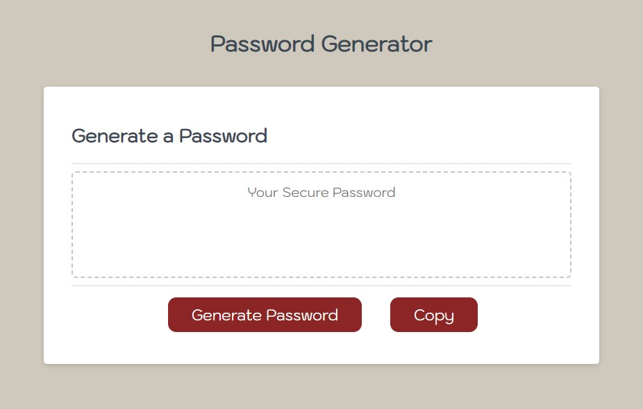

# Module 5 Challenge: Password Generator

## Intermediate JavaScript
 
Creates an application to generate a random password based on criteria as the following. 
1. This app will run in the browser, and will feature dynamically updated HTML and CSS powered by JavaScript. 
2. It will have a clean and polished user interface that is responsive, ensuring that it adapts to multiple screen sizes.

## Instructions

The following image shows the web application's appearance and functionality:

* Generate a password when the button is clicked
  * Present a series of prompts for password criteria
    * Length of password
      * Between 10 and 64 characters
    * Character types
      * Lowercase
      * Uppercase
      * Numeric
      * Special characters ($@%&*, etc)
  * Code should validate for each input and at least one character type should be selected
  * Once prompts are answered then the password should be generated and displayed 
  * Once click 'copy' the password should be copied to clipboard
  * Page should not produce any errors in the console when inspecting in Chrome DevTools

## Copyright

© 2023 || Sorada Wright
